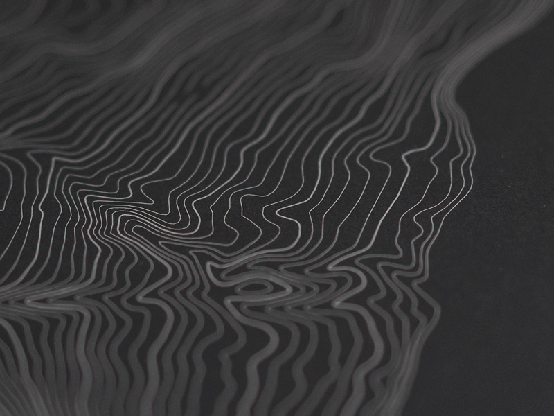
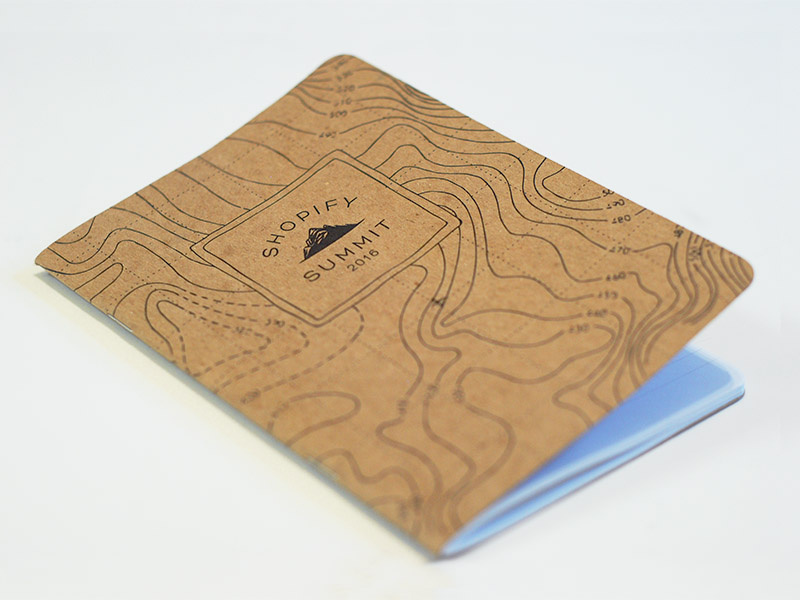
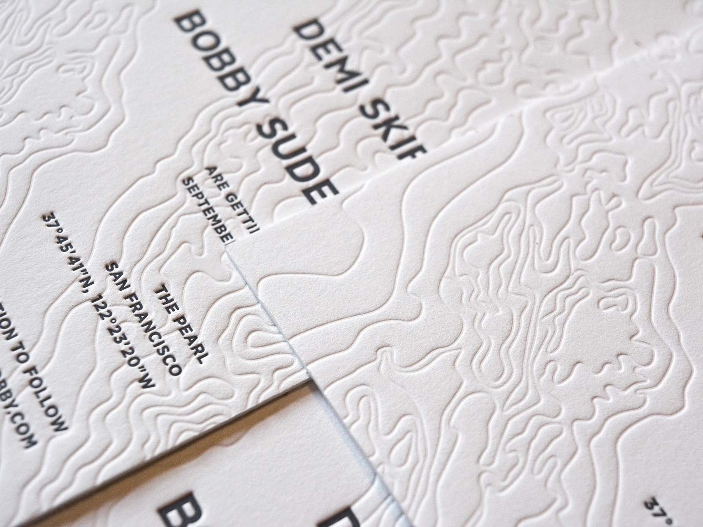
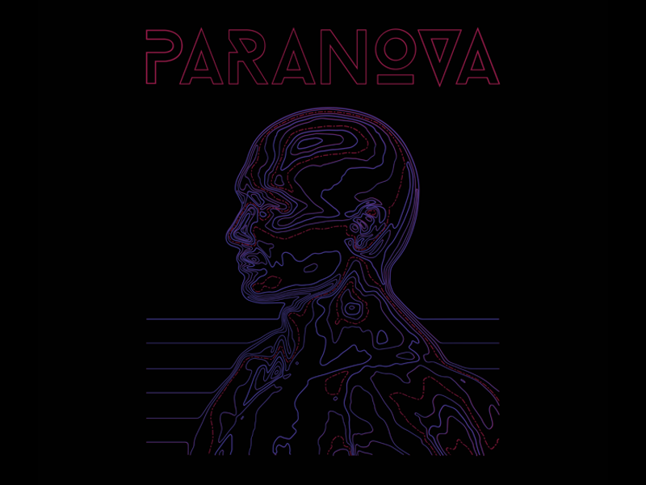
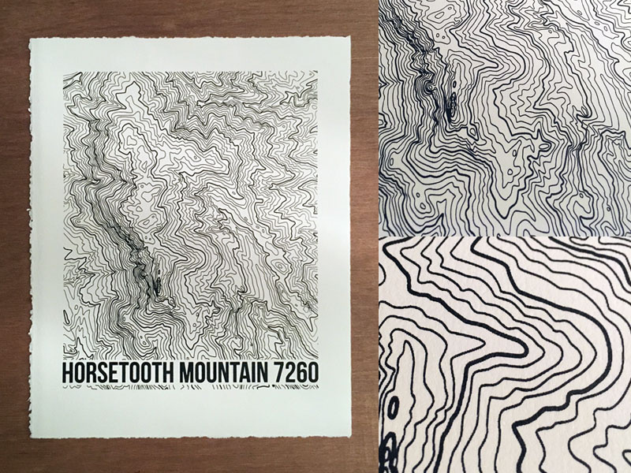

Using topographic map in your design is a great way to fill extra space.
It generates a cool and nature inspired feel.
Great to use on "outdoor" brands.

# Photo of Topographic Calendar

Here we see [Cody](https://dribbble.com/shots/4051011-NST-Desktop-Calendar-Detail) who has taken a photo of his Desktop Calendar.
The topography map is the real map of the North Short Title area, which makes it special and local.
This showcases very well how one can use topography in design to get a local feel.

# Shopify Notebook

For the Shopify Summit 2016 this was given away as swag.
It showcases good how a topographic map can be used to fill "dead" space in a design and make it interesting.

# Save the Date Invitation

[Sara](https://dribbble.com/shots/6277051-Save-The-Date) has used a topographic background for her save the date invitation.
What is really cool with this is it uses letterpress for the topography, which creates a depth to the design.

# Tour Merch
This is a really cool and creative one.
Uses the topograpgic shapes to create another shape - a human!
Very cool and innovative.
Really shows how much is possible with these types of elements in your design.

# Horsetooth Mountain Print

Here [Patric](https://dribbble.com/shots/3259136-Horsetooth-Mountain-Topo) has made a screen print of his local mountain.
A really detailed topographic map can be really interesting visually.
It also gives the local feel since it is a map of an actual local place.

Thanks for checking this blogpost out!